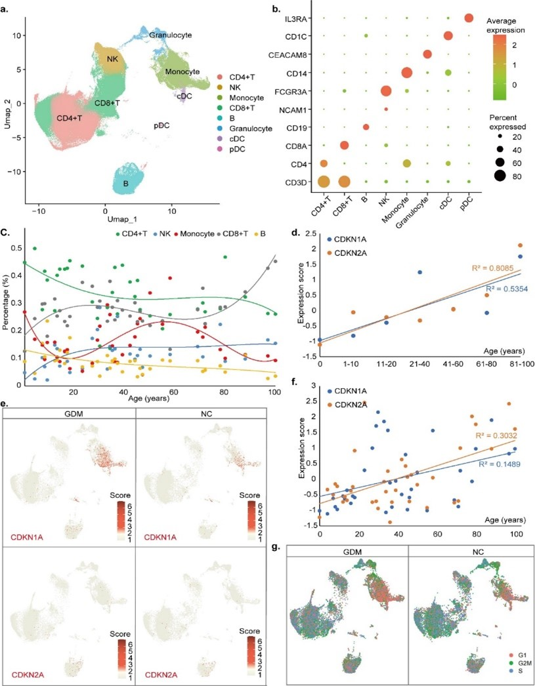
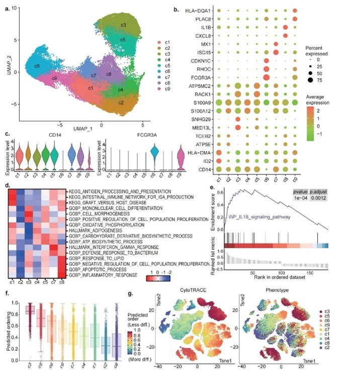

# README

## Code for “The immunological age prediction of monocytes indicates that gestational diabetes mellitus accelerates the aging of monocytes in offspring”
## Please cite "Zhang, Y., Guo, R., Yin, M. et al. The immunological age prediction of monocytes indicates that gestational diabetes mellitus accelerates the aging of monocytes in offspring. Immun Ageing 22, 18 (2025). https://doi.org/10.1186/s12979-025-00513-z"

## Description

### Fig. 1. The impact of age and adverse intrauterine conditions on monocytes as determined by recognized indicators of cellular senescence

- **(a)** UMAP visualization displaying the clusters of all immune cells.
- **(b)** Dotplot illustrating the marker genes of each immune cell.
- **(c)** Scatter plots were generated to depict the relationship between the proportion of immune cells in healthy individuals and age, and linear regression was used for curve fitting.
- **(d, f)** The scatter plots illustrate the mean expression levels of CDKN1A and CDKN2A in immune cells of individuals without health conditions across various age groups (d) or at different ages (f). Linear regression was used to model the data, and the Pearson correlation coefficient (R2) was used to quantify the relationship between the expression of aging-related genes and chronological age.
- **(e)** The feature plot analysis illustrates the differential expression patterns of established age-related genes in cord blood immune cells of offspring born to mothers with gestational diabetes mellitus (GDM) compared to those born to healthy controls.
- **(g)** Cell cycle prediction results showing the distribution of cells in the G1, G2/M, and S phases.

### Fig. 2. Transcriptional characteristics of subclusters present within monocytes

- **(a)** UMAP plot showing the clusters of all monocytes.
- **(b)** Dot plot showing the characteristic genes of each monocyte cluster.
- **(c)** Violin diagram showing the expression of CD14 and FCGR3A (CD16) in each monocyte cluster.
- **(d)** Heatmaps showing pathway enrichment results for each monocyte cluster.
- **(e)** KEGG enrichment demonstrated the upregulation of the IL8 signaling pathway in c8.
- **(f)** The ability of CytoTrace to infer the level of cell differentiation is demonstrated through a boxplot, which illustrates the anticipated degree of differentiation within each group of monocytes.
- **(g)** Left: CytoTrace was utilized on the left to forecast the cell cycle distribution, with colors indicating the anticipated level of differentiation. The TSNE diagram was used to visualize the anticipated cellular localization based on the differentiation level. Right: The diagram illustrates the distribution of distinct clusters within the TSNE diagram.

### Fig. 3. Changes in monocyte composition and gene expression with age

- **(a)** Scatter plots showing the change in the percentage of mononuclear cells in healthy people at each age. Linear regression was used for fitting.
- **(b)** The bubble map shows the pathway enrichment results of upregulated genes with age.
- **(c)** Heatmaps showing age-dependent changes in the expression of upregulated (top half) and downregulated (bottom half) genes in each cluster.

### Fig 4. Construction of the immune age prediction model

- **(a)** The prediction results of the random forest prediction model in the training set (top) and the test set (bottom). The Pearson correlation coefficient (R2) was utilized to quantify the relationship between the predicted age and the actual age.
- **(b)** Violin chart showing the age prediction of monocytes in healthy controls and patients with mild or severe COVID-19 in the GSE206283 dataset at first admission. One-way ANOVA was used to calculate the difference between the groups.
- **(c)** Bar chart showing the age prediction of monocytes in healthy controls and patients with mild or severe COVID-19 at first admission. An independent t-test was used to calculate the differences between the groups.
- **(d)** Violin plot showing the difference between the predicted age of monocytes and the actual age at first admission to the hospital in healthy controls and patients with mild or severe COVID-19. One-way ANOVA was used to calculate differences between groups.
- **(e)** The bar chart shows the difference between the predicted age of monocytes and the actual age of healthy controls and mild or patients with severe COVID-19 when they were first admitted. The difference between groups was calculated using independent t-tests.

## Dataset

We use the data from the Gene Expression Omnibus (GEO) database:
- GSE158055: Single-cell sequencing data of PBMCs from 20 healthy controls.
- GSE157007: Single-cell sequencing data of PBMCs from 9 healthy adults.
- GSE135779: Single-cell sequencing data of PBMCs from 16 healthy subjects.
- GSE206283: Single-cell sequencing data of PBMCs from healthy controls and COVID-19 patients upon their first hospital admission.
- CBMCs and PBMCs from healthy children from GSE212309 and GSE221297.
- Cord blood and PBMCs from healthy children from GSE212309 and GSE221297.

## Requirements

- R==4.0.3
- Seurat==3.2.3
- harmony==1.0.1
- Matrix==1.2
- Rcpp==0.11.0
- RcppAnnoy==0.0.16
- AUCell==1.28.0
- cytoTRACE==1.1
- lme4==1.1

- Python==3.11

## Run the code

1. **Quality control**
   - Run `quality_control.R`.
2. **Total cell clustered and debatched**
   - Run `ALL_seurat.R`.
3. **Cell cycle prediction**
   - Run `CellCycle.R`.

4. **Monocyte clustered**
   - Run `mono_seurat.R`.
5. **AUCell analysis**
   - Run `AUCell.R`.
6. **cytoTRACE**
   - Run `CytoTRACE.R`.

7. **Data preparation**
   - Run `Part2.R` to output the average expression of each gene per sample.
   - If need to remove the batch effect of gene expression using Seurat v3’s canonical correlation analysis (CCA) before MELR, run `Seurat_CCA.R`.
8. **MELR**
   - Run `lim4.R`.

9. **Construction of the immune age prediction model**
   - Run `immune_age.py`.

